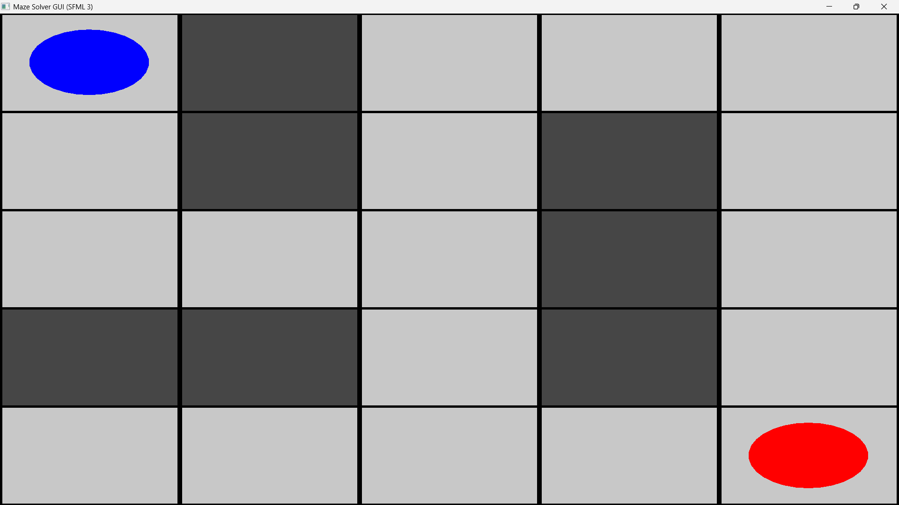
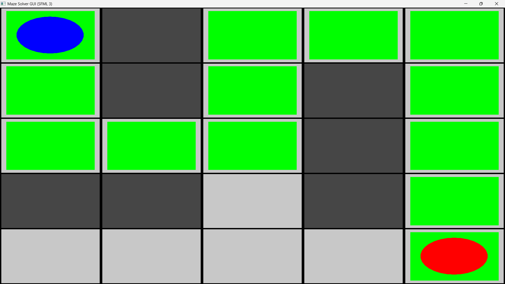
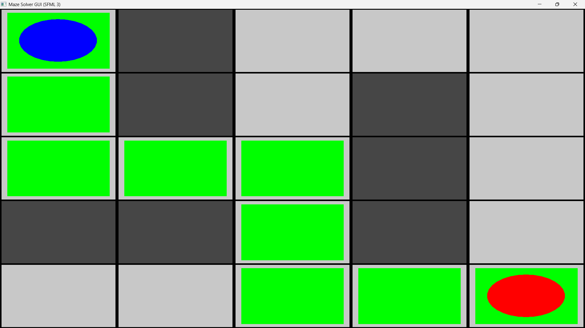

# Maze Solver using Backtracking and Dijkstra's Algorithm

## Overview

This project is a Maze Solver application developed in C++ using SFML for graphical visualization.

The program demonstrates two pathfinding algorithms:

1. Backtracking Algorithm
2. Dijkstra's Algorithm

The maze is represented as a grid where:

* White cells represent open paths.
* Black cells represent walls.
* The algorithm finds a path from the start cell to the destination cell.

## Features

* Interactive GUI using SFML
* Maze visualization
* Backtracking pathfinding
* Dijkstra shortest path finding
* Comparison of two algorithms
* Reset functionality

## Technologies Used

* C++
* SFML 3.0.2
* MinGW g++

## Algorithms

### Backtracking

A recursive depth-first search technique that explores all possible paths until a valid path is found.

Time Complexity:
O(4^(N×N)) in the worst case.

### Dijkstra's Algorithm

A shortest path algorithm that uses a priority queue to always expand the nearest node first.

Time Complexity:
O((V + E) log V)

## Controls

* B : Run Backtracking
* D : Run Dijkstra
* R : Reset Maze

## Project Structure

maze_gui.cpp - Main GUI source code

maze_gui.exe - Executable application

sfml-graphics-3.dll

sfml-window-3.dll

sfml-system-3.dll

## How to Run

1. Download or clone the repository.
2. Keep all DLL files in the same folder as maze_gui.exe.
3. Run maze_gui.exe.

## Applications

* Robotics Navigation
* AI Path Planning
* Game Development
* GPS Routing Systems
* Network Routing

## Project Screenshots

### Graphical User Interface (GUI)

### Backtracking Algorithm Output

### Dijkstra's Algorithm Output

## Author

Harshvardhan Vanmore
